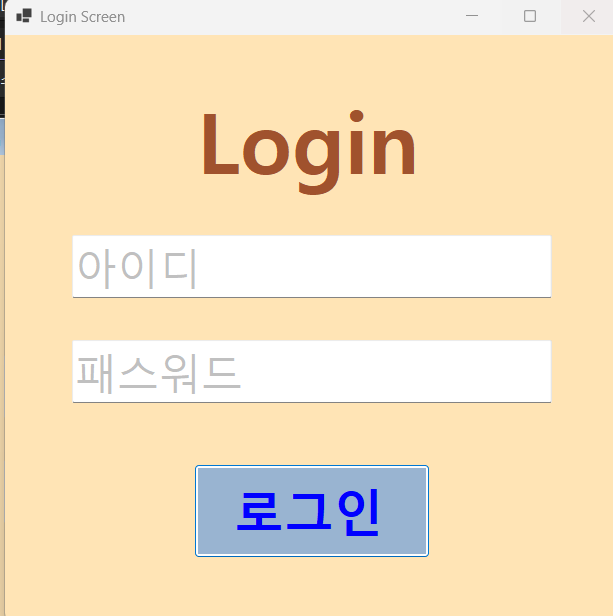
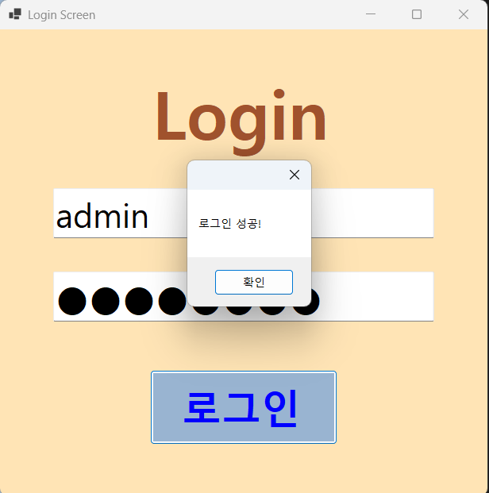
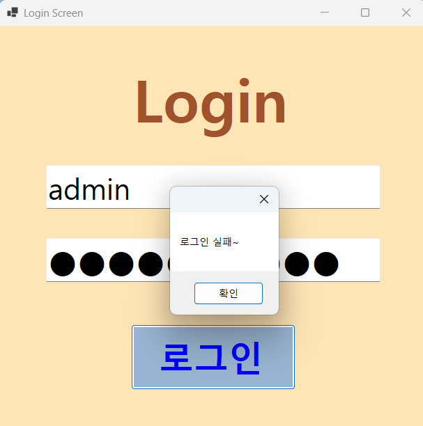
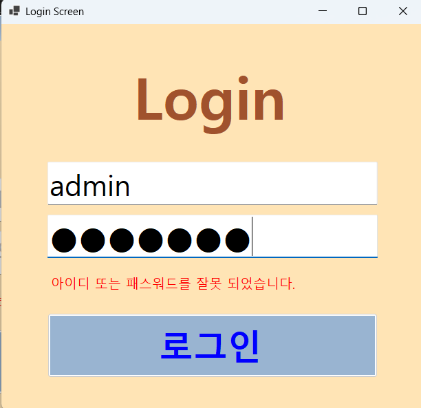
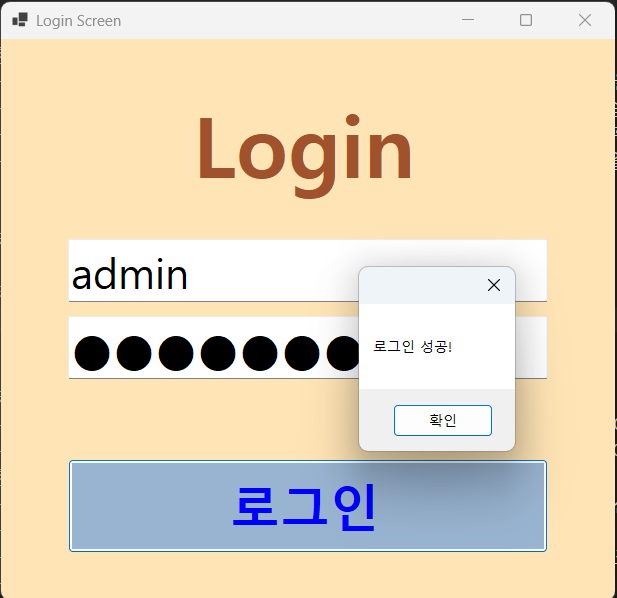

# (C# 코딩) 로그인 스크린
## 개요
- C# 프로그래밍 학습
- 1줄 소개: 아이디와 비밀번호를 입력해 로그인하는 간단한 프로그램
- 사용한 플랫폼:
	- C#, .NET Windows Forms, Visual Studio, GitHub
- 사용한 컨트롤:
	- Label, TextBox, Button
- 사용한 기술과 구현한 기능:
	- 비교연산자&&를 사용해 아이디와 비밀번호가 모두 일치하는지 확인하는 기능
	- Enter, leave 이벤트를 사용해 placeholder 기능 구현
	- 탭 속성 설정을 통해 텍스트박스 간의 이동 편의성 향상
	- passwordChar 속성을 사용해 비밀번호 입력 시 보안 강화

## 실행 화면 (과제1)
- 과제1 코드의 실행 스크린샷

- 과제 내용
	- Label(표시), TextBox(입력), Button(전송), ListBox(대화창)를 적절히 배치합니다.
	- 아이디와 패스워드 입력 힌트를 회색으로 표시
	- 아이디와 패스워드가 모두 맞아야 로그인 허용
	- 로그인 성공/실패 메시지 박스 보여주기

- 구현 내용과 기능 설명
	- placeholder 기능을 구현했습니다. (텍스트박스에 입력이 없을 때, 회색으로 안내 문구가 보이는 기능)
	- 탭 속성을 설정하여 텍스트박스 간의 이동이 편리하도록 했습니다..
	- &&연산자를 사용하여 아이디와 비밀번호가 모두 일치하는지 확인하는 기능을 구현했습니다.
	- passwordChar 속성을 사용하여 비밀번호 입력 시 보안 기능을 강화했습니다.

## 실행 화면 (과제2)
- 과제2 코드의 실행 스크린샷

- 과제 내용
	- 아이디 또는 패스워드가 잘못 입력되었을 때 에러 메시지 보여주기
	- MessageBox를 띄우지 말고 아이디와 패스워드를 입력하는 곳에 보여주기
- 구현 내용과 기능 설명
	- 아이디 또는 패스워드가 잘못 입력되었을 때, visible 속성을 사용하여 에러 메시지를 보여주도록 구현했습니다.
	- 아이디와 패스워드가 모두 일치하고 에러 메시지가 있을경우 에러 메시지를 숨기도록 구현했습니다.
	- 주석처리를 통해 잘못 입력되었을 때, MessageBox를 띄우는 코드를 숨겼습니다.
	- UX를 개선하였습니다.